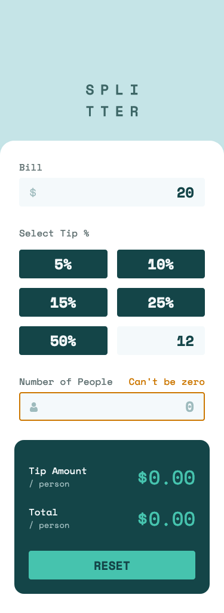
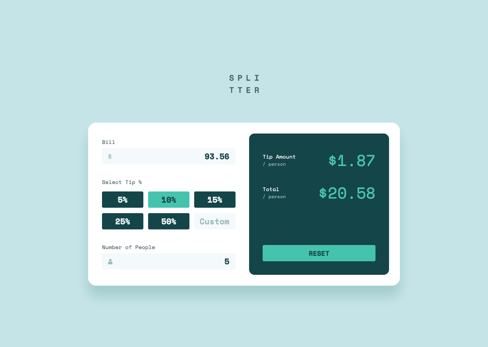

# Frontend Mentor - Tip Calculator App solution

This is a solution to the [Tip Calculator App challenge on Frontend Mentor](https://www.frontendmentor.io/challenges/tip-calculator-app-ugJNGbJUX). Frontend Mentor challenges help you improve your coding skills by building realistic projects.

## The challenge

Users should be able to:

- View the optimal layout for the app depending on their device's screen size
- See hover states for all interactive elements on the page
- Calculate the correct tip and total cost of the bill per person

## Screenshot

### Mobile

### Desktop

## Built with

- Semantic HTML5 markup
- CSS custom properties
- Flexbox
- CSS Grid
- Mobile-first workflow
- JavaScript

## What I learned

Regarding the JavaScript, this is probably the most complicated project I have completed so far. I found myself writing JS code then adding comments later to remind myself what it did. I think in future projects I will try writing the comments first so that the logic is in place to start with and then try writing the code once I have set out exactly what I am trying to achieve with each step.

TBC...

## Continued development

TBC...